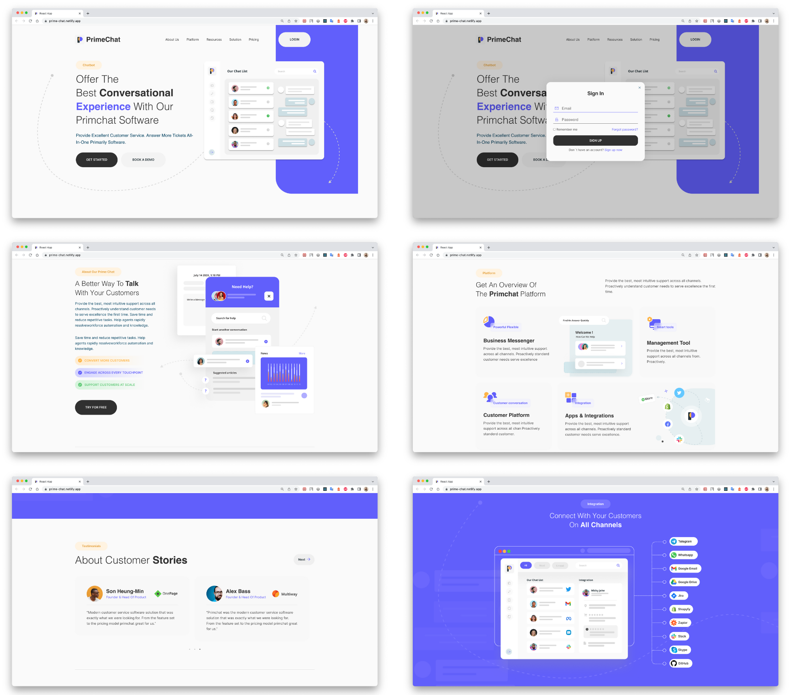
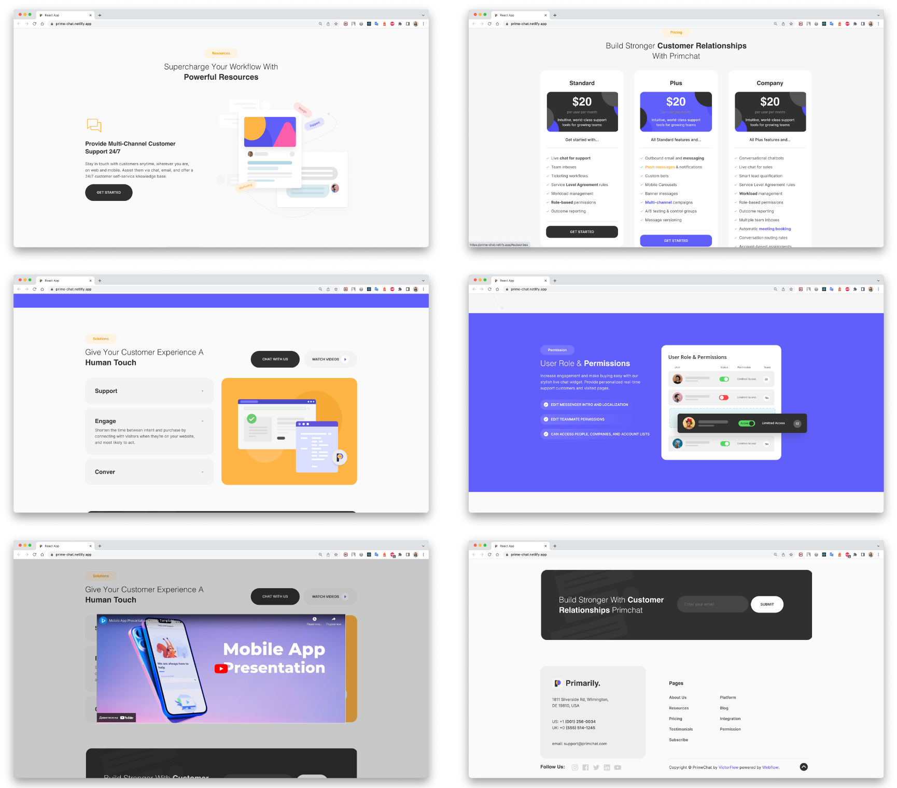
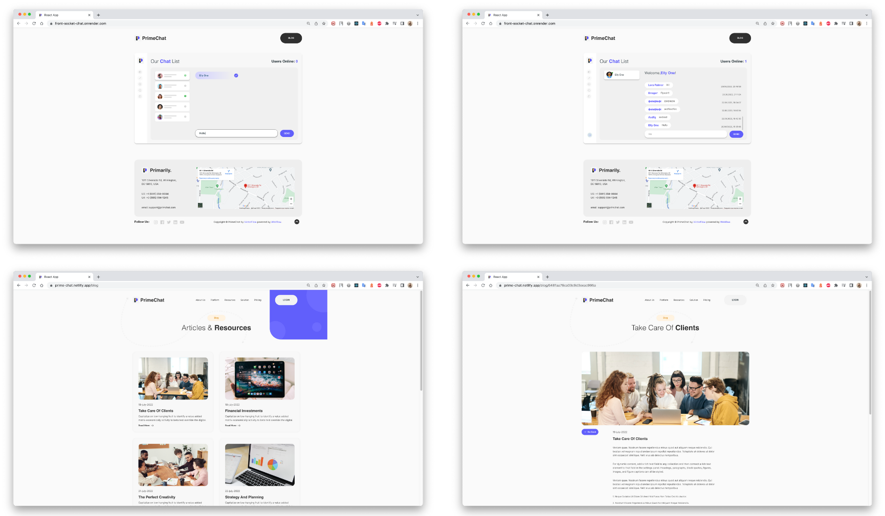

<h1> 📎Prime Chat web-site</h1>

This is a demo real-time chat application project to learn <b>Socket.io</b> (Full Stack Chatting App).

The application has been developed taking into account the adaptive layout from mobile devices to desktops and built using <b>React, Node.js</b>. Uses <b>Socket.io</b> for real-time communication and stores user details in encrypted format in <b>Mongo DB</b> Database.

      

## Description

The application consists of four pages: The Prime Chat project website, the Prime Chat blog (with separate pages for blog posts), the "Not Found" page, and the demo chat page. Since the application only has a demo version and is not fully represented on the market, the user is first directed to the Prime Chat project website, where he or she can learn a little more about the company, its achievements, and strategy, get acquainted with the product and its development prospects, read the first user reviews and leave his or her contacts for potential cooperation. The registration and log-in page to the user's personal account is currently under construction.
 

Users can also go to our Articles & Resources blog page, which contains the latest news and useful resources from our developers.

The current version of the app allows you to join a chat and send messages in a real-time mode. Our users can test the demo version of the chat by going to the corresponding page and entering their names. The user can also see the chat history, the time and date of the message, and the number of users who are online.  Each user gets a random avatar in the online chat.

## Tech Stack
* <b>Client :</b> React JS
* <b>Server :</b> Node JS
* <b>Database :</b> Mongo DB
* <b>Deployment :</b> Netlify, Render

## Links To Repositories 
* <b>[Front-End :](https://github.com/Ostrynska/prime-chat)</b> 
* <b>Back-End :</b>
  - [Socket.io](https://github.com/Ostrynska/back-socket)
  - [Blog](https://github.com/Ostrynska/back-blog)
  
## How To Run:
**1. Open terminal (Mac OS) or cmd (Windows)**  

**2. Check npm version:**
* `npm -v`
  - Should print something like `6.4.1`

**3. Install Dependencies**
* Navigate to the project folder and run: `npm install`

**4. Run Project**
* `npm start`
  
 
 
 
